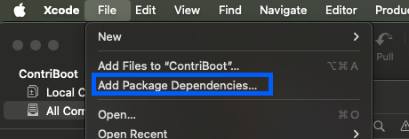
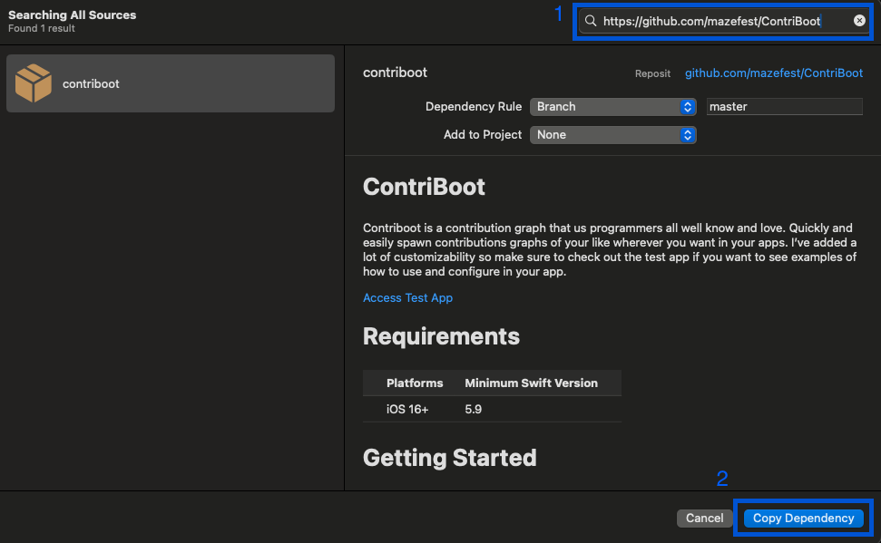
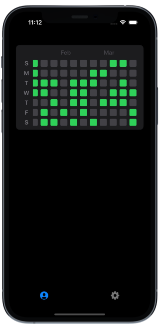

# ContriBoot
Contriboot is a contribution graph that us programmers all well know and love. Quickly and easily spawn contributions graphs of your like wherever you want in your apps. I've added a lot of customizability so make sure to check out the test app if you want to see examples of how to use and configure in your app.

[Access Test App](https://github.com/mazefest/MooCal/wiki/Accessing-the-Test-App)

# Requirements

| Platforms    | Minimum Swift Version |
|--------------|-----------------------|
| iOS 16+      | 5.9                   |

# Getting Started

### Swift Package Manager
1. in XCode go to `File` -> `Add Package Dependencies...`



2. In the searchbar paste the github url `[https://github.com/mazefest/MooCal](https://github.com/mazefest/ContriBoot)` and select `Add Package`.
   


Now you can import ContriBoot and use the library where ever you like.

# Integration

### 1. Import ContriBoot

Import ContriBoot inside of the desired file you are wanting to implement Contriboot's features.

```swift
import ContriBoot
````

### 2. Setup Your Data

First thing we are going to need to do is make your data models able to work with `ContriBoot` do this by making your model conform to `Contributable`.

```swift
struct YourDataModel: Contributable {
var workout: String
var date: Date // <-- needed for coforming to Contributable
}
```
Now your data can be used with `ContriBoot`

## 3. Making the Graph
Now we just need to pass in your data
```swift
List {
  ContriBootYearGraph(items: [YourDataModel])
}
```
This will give you the default Contribution graph, as shown below.



# Different Stlyes
Now you can configure the graph to look anway you like. There are currently 3 available styles. You can modify the `ContriBootYearGraph` by modifying it with the `.style(_ ContributeStyle)` function.

## BinaryContributeStyle
Contribution colors will be colored if there is more than one contirbution for that specific date. You can also configure
`BinaryContributeStyle(color: Color, absentColor: Color, cornerRadius: Double)`
color: `Color` -> Color of the squares with contributions.
absentColor: `Color` -> Color of squares with `0` contributions.
cornerRadius: `Double` -> Corner radius for contribution squares.
```
List {
   Section {
      ContriBootYearGraph(items: data)
         .contributeStyle(BinaryContributeStyle()) // <- HERE
   }
                
   Section {
      ContriBootYearGraph(items: data)
         .contributeStyle(BinaryContributeStyle(color: .pink))
   }
}
```

## GradientContributeStyle
Contibution will be colored with an opacity value based off the max contirbution count in the year.
`GradientContributeStyle(color: Color, absentColor: Color, cornerRadius: Double)`
color: `Color` -> Color of the squares with contributions.
absentColor: `Color` -> Color of squares with `0` contributions.
cornerRadius: `Double` -> Corner radius for contribution squares.
```
List {
   Section {
      ContriBootYearGraph(items: data)
         .contributeStyle(GradientContributeStyle()) // <- Here
   }
                
   Section {
      ContriBootYearGraph(items: data)
         .contributeStyle(GradientContributeStyle(color: .pink))
   }
}
```

## CustomContributeStyle
You are in control, you have to do all the work now.

When using `CustomContributeStyle(customView: () -> some View)` you will have to provide the view yourself inside the completion handler. You will be given the number of contributions for the day the view is drawing and can make decisions on what view should be displayed.

```
Section {
    ContriBootYearGraph(items: data)
       .contributeStyle(CustomContributeStyle({ contributions in // <- Your custom implementation here
           if contributions.count > 0 {
               Image(systemName: "checkmark.circle.fill")
                   .bold()
                   .foregroundStyle(Color.green)
           } else {
               ContributionSquareView(color: Color.gray.opacity(0.33))
           }
       }))
}
```
